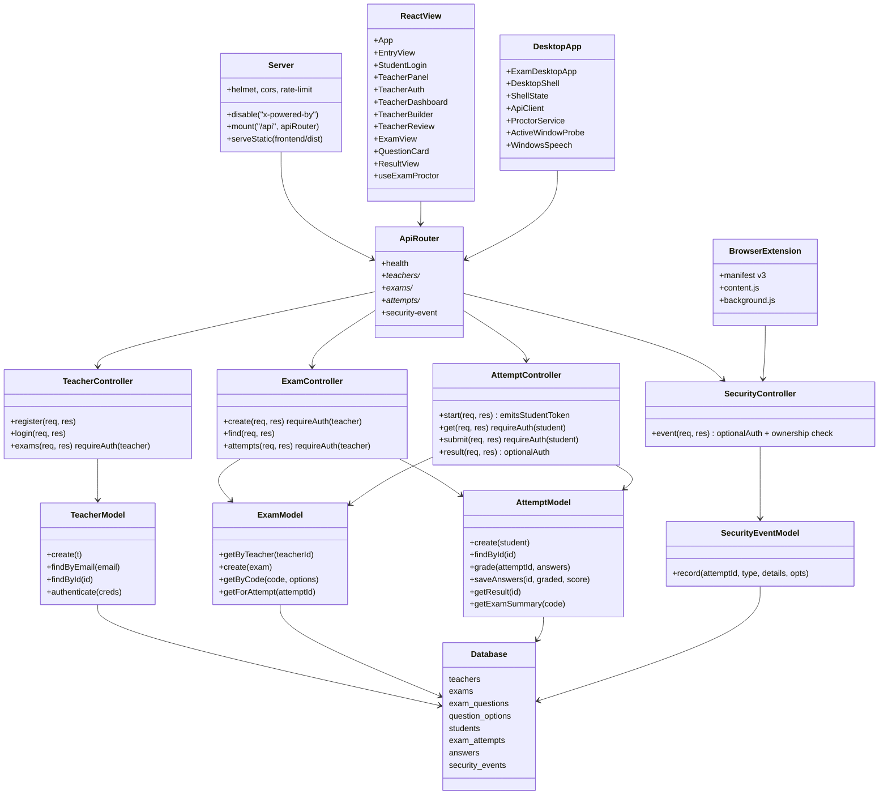

# Documentacion tecnica

## 1. Objetivo

Integrar Interaccion Ser Humano-Computadora (HCI), usabilidad y accesibilidad universal en un sistema de examen en linea construido con el patron Modelo-Vista-Controlador (MVC). El sistema debe ser eficiente, inclusivo, supervisado y culturalmente adecuado para estudiantes hispanohablantes.

## 2. Mapa de modulos y separacion estricta

| Modulo | Puerto | Responsabilidad | NO hace |
| --- | --- | --- | --- |
| Backend | 3000 | API REST JSON, persistencia, autenticacion, autorizacion | No sirve HTML ni archivos estaticos del frontend |
| Frontend web | 5173 | Vista React accesible, build con Vite, hooks de supervision, consume el backend via fetch + Bearer | No habla con SQLite |
| Extension | --- | Extension Chrome MV3 que reporta navegacion externa | No tiene UI propia |
| Desktop | --- | App Flutter Windows con supervision local avanzada | No tiene servidor propio |
| Docs | --- | Documentacion tecnica, informe UX, plan de pruebas | --- |
| Datos | --- | `exam.sqlite` (`LOCALAPPDATA` por defecto) | --- |

El backend solo entrega JSON. Si abres `http://localhost:3000/` en el navegador veras un JSON con la lista de endpoints disponibles. Si entras a una ruta inexistente recibiras `404 application/json` con `{ "error": "Recurso no encontrado." }`. **Nunca** se devuelve HTML desde el backend.

Esto es lo que diferencia las dos capas:

```
┌──────────────────────────┐            ┌──────────────────────────┐
│  Frontend (UI, React)    │  fetch +   │  Backend (API, Express)  │
│  http://localhost:5173   │  Bearer    │  http://localhost:3000   │
│  - paginas, formularios  │  ────────► │  - rutas /api/*          │
│  - hooks de supervision  │            │  - controladores         │
│  - paleta y accesibili-  │            │  - modelos SQLite        │
│    dad                   │  JSON      │  - JWT + helmet + cors   │
│                          │  ◄────────  │  - rate limiting         │
└──────────────────────────┘            └──────────────────────────┘
```

## 3. Arquitectura MVC

### 3.1 Backend (`backend/src`)

```
backend/src/
├── server.js                 # Bootstrap Express, middlewares globales
├── config/
│   ├── env.js                # Variables de entorno y secretos
│   └── database.js           # Conexion SQLite, esquema, migraciones suaves
├── middleware/
│   ├── auth.js               # JWT requireAuth(role) y optionalAuth
│   ├── errorHandler.js       # Manejador uniforme + 404
│   ├── rateLimit.js          # Limites para login, API y eventos de supervision
│   └── security.js           # helmet (CSP) + CORS por origenes permitidos
├── routes/
│   └── index.js              # buildApiRouter() registra y protege rutas
├── controllers/
│   ├── HealthController.js
│   ├── TeacherController.js  # register, login, listar examenes propios
│   ├── ExamController.js     # crear examen, buscar por codigo, ver intentos
│   ├── AttemptController.js  # iniciar, ver, enviar y resultado del intento
│   └── SecurityController.js # registrar eventos anti-trampa
├── services/
│   └── ExamSeedService.js    # Crea docente y examen demo si no existen
├── models/
│   ├── TeacherModel.js
│   ├── ExamModel.js
│   ├── AttemptModel.js
│   └── SecurityEventModel.js
└── utils/
    ├── jwt.js                # signTeacherToken, signStudentToken, verifyToken
    ├── passwords.js          # scrypt + verificacion timing-safe
    └── validators.js         # Validacion de docente, estudiante y examen
```

Cada controlador valida la entrada, delega en el modelo y construye la respuesta JSON. Los modelos solo conocen SQL. Los servicios encapsulan flujos compuestos (semilla inicial, futura exportacion CSV, etc.).

### 3.2 Frontend (`frontend/src`)

```
frontend/src/
├── main.jsx                  # Punto de entrada React
├── App.jsx                   # Router por reducer (entry, exam, result)
├── styles.css                # Variables de tema y layout
├── api/
│   └── client.js             # fetch + Bearer + sessionStorage
├── hooks/
│   └── useExamProctor.js     # Eventos DOM y dialogo con extension
├── components/
│   ├── TextField.jsx
│   ├── ErrorList.jsx
│   └── StatusTile.jsx
├── pages/
│   ├── EntryView.jsx
│   ├── StudentLogin.jsx
│   ├── teacher/
│   │   ├── TeacherPanel.jsx
│   │   ├── TeacherAuth.jsx
│   │   ├── TeacherDashboard.jsx
│   │   ├── TeacherBuilder.jsx
│   │   └── TeacherReview.jsx
│   └── exam/
│       ├── ExamView.jsx
│       ├── QuestionCard.jsx
│       └── ResultView.jsx
└── utils/
    ├── format.js             # formatTime, speak (SpeechSynthesis)
    └── labels.js             # questionTypes, labelEvent/Severity/Source
```

### 3.3 App desktop (`sistema-examen-mvc-accesible-app-desktop/lib`)

```
lib/
├── main.dart                       # ExamDesktopApp + tema
├── theme/
│   └── app_colors.dart             # Paleta unificada con la web
├── services/
│   ├── api_client.dart             # HTTP + Bearer + reintentos basicos
│   ├── proctor_service.dart        # Lifecycle + teclado + window probe
│   ├── active_window_probe.dart    # PowerShell Win32 GetForegroundWindow
│   ├── windows_speech.dart         # System.Speech para TTS
│   └── error_format.dart
├── models/
│   ├── api_models.dart             # DTOs JSON
│   └── question_draft.dart
├── widgets/
│   └── common.dart                 # Surface, Notice, Metric, Choice, etc.
└── features/
    ├── shell/
    │   ├── desktop_shell.dart      # NavigationRail + ListenableBuilder
    │   └── shell_state.dart        # ChangeNotifier con toda la logica
    └── views/
        ├── student_view.dart
        ├── teacher_auth_view.dart
        ├── teacher_dashboard_view.dart
        ├── teacher_builder_view.dart
        ├── teacher_review_view.dart
        ├── exam_view.dart
        └── result_view.dart
```

## 4. Diagrama UML de clases



## 5. Justificacion bajo ISO 9241

ISO 9241 entiende usabilidad como eficacia, eficiencia y satisfaccion en un contexto especifico de uso. El sistema cubre cada dimension:

- **Eficacia.** El estudiante puede iniciar, responder y enviar el examen. El docente puede crear examenes con codigo y consultar la revision con notas, aciertos e incidentes. Cada operacion devuelve mensajes claros con texto, no solo color.
- **Eficiencia.** El flujo principal tiene tres estados (`entry`, `exam`, `result`). Cada pantalla mantiene menos de 7 bloques principales, cumpliendo la regla de retencion 5±2 elementos.
- **Satisfaccion.** Los formularios y botones usan un sistema visual consistente (paleta unificada web/desktop, mismo lenguaje academico). Los avisos de supervision explican el motivo y guian al estudiante.
- **Contexto de uso.** Examen academico supervisado en navegador, con extension opcional y app desktop institucional. La paleta es legible en luz ambiente de aulas (contraste tinta `#16201C` sobre crema `#F5F1E7` ≥ 13:1, AAA).

## 6. Flujo funcional

1. El docente registra o inicia sesion (`POST /api/teachers/register|login`). El backend devuelve token JWT firmado.
2. El frontend guarda el token en `sessionStorage` (no `localStorage`); las peticiones siguientes envian `Authorization: Bearer <token>`.
3. El docente crea un examen (`POST /api/exams`); el backend valida, asigna `teacher_id`, persiste preguntas y opciones.
4. El docente comparte el `accessCode` con el estudiante.
5. El estudiante ingresa con nombre, correo institucional y codigo (`POST /api/attempts`). El backend crea registro de estudiante e intento, devuelve token de estudiante para subsecuentes acciones.
6. La vista carga preguntas via `GET /api/attempts/:id` (token de estudiante obligatorio); el contador y la supervision se inician.
7. Eventos de supervision se reportan a `POST /api/security-event` con `attemptId`, `eventType`, `severity`, `source` y `metadata`. El backend valida que el token corresponda al `attemptId`.
8. Al enviar (`POST /api/attempts/:id/submit`), el modelo califica contra las respuestas correctas y persiste resultado.
9. El docente consulta `GET /api/exams/:code/attempts` (token docente) y ve estudiantes, aciertos, puntajes e incidentes.

## 7. Seguridad y supervision academica

### 7.1 Backend

- **Autenticacion.** `passwords.hashPassword` usa scrypt con salt aleatorio; `verifyPassword` usa `timingSafeEqual`. JWT firmado HS256 con `JWT_SECRET` (auto-generado en desarrollo, obligatorio en produccion).
- **Autorizacion.** `requireAuth('teacher')` para gestion de examenes; `requireAuth('student')` para acciones del intento; verificacion adicional de propiedad: el docente solo accede a sus propios examenes; el estudiante solo a su propio intento.
- **Cabeceras y CSP.** `helmet` aplica Content-Security-Policy estricta, `X-Content-Type-Options`, `X-Frame-Options: DENY`, etc.
- **CORS por lista.** `CORS_ORIGINS` define los origenes permitidos.
- **Rate limiting.** 8 intentos de login cada 5 minutos por IP, 240 peticiones por minuto a la API, 120 eventos de supervision por minuto.
- **Validacion.** `validators.js` exige correo bien formado, contrasena ≥ 8, codigo de examen `[A-Za-z0-9_-]{4,32}`, duracion 5-360 minutos, hasta 100 preguntas por examen.
- **Errores controlados.** En produccion los mensajes son genericos. En desarrollo se muestra el detalle.
- **Seed configurable.** `DEMO_TEACHER_PASSWORD` y `DISABLE_SEED=1` permiten desactivar la cuenta demo.

### 7.2 Frontend (capa web)

- **Eventos registrados:** `tab_hidden`, `window_blur`, `fullscreen_exit`, `context_menu`, `copy`, `paste`, `text_selection`, `blocked_shortcut` (Ctrl+C/V/X/A/L/T/N/W/R/P/S/U/F, Alt+Tab, Alt+F4, PrintScreen).
- **Sesiones en `sessionStorage`** (no persisten al cerrar pestana).
- **Tokens nunca aparecen en URLs** (solo cabecera Authorization).

### 7.3 Extension de navegador (Manifest V3)

Detecta y reporta `new_tab`, `tab_activated`, `url_changed`, `web_navigation`, `search_detected` con `source: 'extension'`. Solo se activa cuando la web emite `EXAM_PROCTOR_START` por `window.postMessage`.

### 7.4 App desktop Flutter

`ProctorService` integra varias capas de deteccion:

- **Lifecycle Flutter** via `WidgetsBindingObserver`: emite `desktop_lifecycle` con severidad `grave` cuando el estado es `paused` o `hidden`, `media` para `inactive`.
- **Captura de teclado** via `HardwareKeyboard.addHandler`: detecta PrintScreen (`grave`), Win+Shift+S (`grave`), Alt+Tab (`media`), bloquea Ctrl+P, registra Ctrl+C/Ctrl+V.
- **Sondeo de ventana en primer plano** (`active_window_probe.dart`) cada 2 s usando PowerShell + user32.dll. Lista negra ampliada:
  - **Grave:** chatgpt, copilot, claude, gemini, perplexity, bard, character.ai, mistral, deepseek, telegram, whatsapp, discord, signal, anydesk, teamviewer, rustdesk, parsec, chrome remote, rdp, vnc.
  - **Media:** chrome, edge, firefox, brave, opera, vivaldi, youtube, obs, streamlabs, bandicam, camtasia, sharex, snipping tool, screenpresso, lightshot, zoom, teams, meet, webex, skype, slack, cmd, powershell, terminal.
- **Escaneo de procesos** cada 8 s para detectar grabadores incluso si no tienen foco: emite `desktop_screen_recorder` con severidad `grave`.
- **HTTP Bearer.** El cliente envia el token recibido en login docente o en el inicio de intento del estudiante.

## 8. Variables de entorno

| Variable | Por defecto | Descripcion |
| --- | --- | --- |
| `PORT` | `3000` | Puerto del servidor |
| `NODE_ENV` | `development` | Activa errores genericos en `production` |
| `JWT_SECRET` | aleatorio en dev | Obligatorio ≥ 32 caracteres en `production` |
| `JWT_EXPIRES_IN` | `8h` | Vigencia del token |
| `CORS_ORIGINS` | `http://localhost:3000,http://localhost:5173` | Lista separada por coma |
| `BODY_LIMIT` | `256kb` | Tamano maximo del JSON |
| `DEMO_TEACHER_EMAIL` | `demo@institucion.edu` | Cuenta semilla |
| `DEMO_TEACHER_PASSWORD` | `demo1234` | Cambiar en despliegue |
| `DISABLE_SEED` | desactivado | `1` para no insertar datos demo |
| `LOGIN_RATE_MAX` / `LOGIN_RATE_WINDOW_MS` | `8` / `300000` | Limite de login |
| `API_RATE_MAX` / `API_RATE_WINDOW_MS` | `240` / `60000` | Limite global API |
| `DB_PATH` | `%LOCALAPPDATA%/sistema-examen-mvc-accesible/exam.sqlite` | Ruta SQLite |

Para la app desktop:

```bash
flutter build windows --dart-define=EXAM_API_URL=https://servidor.edu
```

## 9. Accesibilidad y HCI aplicada

| Principio | Implementacion |
| --- | --- |
| Independencia del color | Mensajes con icono + texto + borde + jerarquia |
| Etiquetas ALT y voz | `aria-label` en botones, `Semantics` en Flutter, lectura por SpeechSynthesis (web) y System.Speech (desktop) |
| Flexibilidad de entrada | Operable por teclado, mouse y comandos por voz |
| Carga mental baja | Maximo 5±2 bloques por pantalla; lenguaje claro sin codigos internos |
| Foco visible | Borde de enfoque y `skip-link` |
| Consistencia | Misma paleta y mismo lenguaje en web y desktop |
| Prevencion de errores | Validacion en cliente y servidor con mensajes accionables |
| Reconocimiento sobre memoria | Tabs visibles, contador en pantalla, progreso |

## 10. Construccion y ejecucion

Las dos capas web se ejecutan en **procesos separados** y en **puertos distintos**:

```bash
# Terminal 1 - Backend (API JSON, puerto 3000)
cd backend
npm install
npm run dev
# Abre http://localhost:3000/api/health -> {"ok":true,...}

# Terminal 2 - Frontend (UI React, puerto 5173)
cd frontend
npm install
npm run dev
# Abre http://localhost:5173/ -> aplicacion web
# Vite hace proxy automatico de /api a http://localhost:3000

# Opcional - Desktop (consume el backend)
cd sistema-examen-mvc-accesible-app-desktop
flutter analyze
flutter test
flutter run -d windows
```

Si abres `http://localhost:3000/` directamente en el navegador veras un JSON con la documentacion de la API. La interfaz humana esta en `:5173`.
